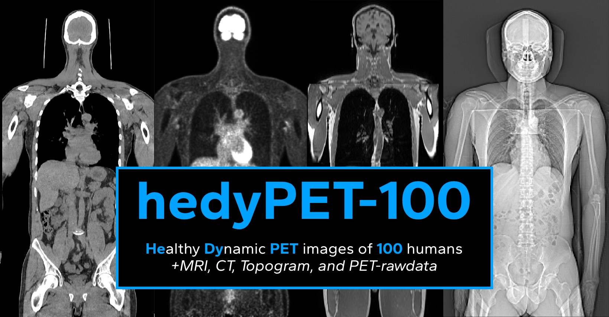

A multimodal total-body dynamic 18F-FDG PET/CT/MRI dataset of 100 healthy humans for quantitative imaging research.

📊 **[Data Explorer](https://hedypet.depict.dk)** | 📥 **[Get Data](https://hedypet.depict.dk)** | 📄 **[Read Publication](https://doi.org/10.xxxx/xxxxxxx)**

## Overview

The hedyPET dataset provides comprehensive multimodal imaging data from 100 healthy participants, stratified by age and sex to capture physiological variation across the adult lifespan. This dataset addresses the critical need for normative reference data in quantitative PET imaging research.

### Dataset Highlights ✨

**Raw Imaging Data**
- **100 healthy participants** (18-100 years, stratified by age and sex) 👥
- **Multiple PET reconstructions** (static and dynamic, with/without attenuation correction) 🔄
- **Listmode PET data** (.ptd format) for retrospective reconstruction harmonization 📊
- **Topogram and Low-dose CT** for anatomical reference and attenuation correction 🩻
- **Whole-body DIXON MRI and T1 MPRAGE** for soft tissue characterization 🧲

**Processed Derivatives**
- **Anatomical segmentations** TotalSegmentator (organs, tissue, and bodyparts), SynthSeg (brain), and nifti_dynamic (input functions) 🧩
- **Pre-extracted time-activity curves** for all organs and tissues 📈
- **Coordinate spaces** Image resampled to different spaces (body-static, body-dynamic, head-space) 🎯
- **Normalization constants** (SUV, SUL, Patlak Ki) ⚖️

## How to Acquire Data 📥

> **Note**: Only 80 train/validation subjects are currently available. The remaining 20 test subjects are reserved for upcoming competitions.

### Pre-computed readouts 
The repository includes pre-computed quantitative measures in the `readouts/` folder. For all segmented regions we have extracted:
- Time-activity curves (TACs)
- Static SUV/SUL measurements
- Patlak Ki values for different input functions and number of frames
- Participant metadata and demographics

🌐 **Explore the data interactively**: [hedypet.streamlit.app](https://hedypet.streamlit.app)

### Full Image Data (Application Required)
Apply for complete imaging data (PET/CT/MRI) by signing up at [datacatalog.publicneuro.eu](https://datacatalog.publicneuro.eu/dataset/super/V2) and completing the Data User Agreement.

## Installation & Setup ⚙️

1. **Clone the repository:**
```bash
git clone https://github.com/depict-rh/hedypet.git
cd hedypet
```

2. **Install the package:**
```bash
pip install -e .
```


3. **Set up environment variables:**
Set the required environment variables in a `.env` file or in the terminal:
```bash
RAW_ROOT=/path/to/hedypet/raw
DERIVATIVES_ROOT=/path/to/hedypet/derivatives
```

## Usage Examples

### Load NIfTI images from raw and pipeline spaces
```python
import nibabel as nib
from hedypet.utils import RAW_ROOT, DERIVATIVES_ROOT

sub = "sub-001"
raw_root = RAW_ROOT / sub
totalsegmentator_root = DERIVATIVES_ROOT / "totalsegmentator" / sub
pipeline_root = DERIVATIVES_ROOT / "pipeline-bodystat" / sub

# Load images in their original spaces
pet_raw = nib.load(next(raw_root.glob("**/*acstatPSF*.nii.gz")))
ct_raw = nib.load(next(raw_root.glob("**/*_ct.nii.gz")))
seg_total = nib.load(next(totalsegmentator_root.glob("**/*seg-total*.nii.gz")))

print(f"PET shape: {pet_raw.shape}, CT shape: {ct_raw.shape}, Seg shape: {seg_total.shape}")

# Load the same images resampled to acstatPSF space (pipeline-bodystat)  
ct_pipeline = nib.load(next(pipeline_root.glob("**/*_ct*.nii.gz")))
seg_pipeline = nib.load(next(pipeline_root.glob("**/*seg-total*.nii.gz")))

print(f"PET shape: {pet_raw.shape}, CT shape: {ct_pipeline.shape}, Seg shape: {seg_pipeline.shape}")
```

**Output:**
```
PET shape: (440, 440, 531), CT shape: (512, 512, 531), Seg shape: (512, 512, 531)
PET shape: (440, 440, 531), CT shape: (440, 440, 531), Seg shape: (440, 440, 531)
```

### Analyze pre-computed readouts
```python
import pandas as pd

# Load static measurements (install indexed_gzip for faster loading)
df = pd.read_pickle('readouts/means_80.pkl.gz')
metadata = pd.read_csv('readouts/metadata.csv')

# Merge with metadata and calculate SUV
df = df.merge(metadata[['Subject', 'SUV Denominator [Bq/mL]']], on='Subject')
df['SUV Mean'] = df['PET Mean [Bq/mL]'] / df['SUV Denominator [Bq/mL]']

# Filter for non-eroded data and calculate mean SUV by organ
organ_means = df[df["Erosion Iterations"] == 0].groupby('Label Name')['SUV Mean'].mean()
print(f"Top 5 organs by SUV:\n{organ_means.sort_values(ascending=False).head()}")
```

**Output:**
```
Top 5 organs by SUV:
seg_region_name
urinary_bladder              27.772495
ctx-lh-transversetemporal    10.941400
ctx-rh-transversetemporal    10.897202
ctx-lh-precuneus              9.888452
Right-Putamen                 9.848088
```

## Data Processing Pipeline 🔧

The derivatives, standardized coordinate spaces, and readouts were created using a series of preprocessing scripts. Large dynamic NIfTI files are processed efficiently using the `nifti_dynamic` library for chunked analysis. Here's the complete workflow:

### Core Processing Scripts
```bash
# 1. Create body-static coordinate space (all images resampled to acstatPSF/OSEM)
python src/hedypet/scripts/01_make_pipeline_bodystat.py

# 2. Create head coordinate space (high-resolution brain analysis)  
python src/hedypet/scripts/02_make_pipeline_head.py

# 3. Create body-dynamic coordinate space (for kinetic modeling)
python src/hedypet/scripts/03_make_pipeline_bodydyn.py

# 4. Generate normalization constants (for SUV/SUL calculations)
python src/hedypet/scripts/04_make_normalization_consts.py

# 5. Create aorta input function ROIs (for kinetic modeling)
python src/hedypet/scripts/05_make_input_function_rois.py

# 6. Extract time-activity curves and static measurements
python src/hedypet/scripts/06_extract_tacs_and_means.py

# 7. Combine readouts to dataframes and save to readouts folder
07_combine_to_dataframes.ipynb
```


For detailed methodology, technical specifications, and validation results, see the accompanying publication.

## Reconstruction Reproducibility 🔧

E7 reconstruction parameter files are provided in the `reconstructions/` folder to enable reproduction of the clinical reconstructions from listmode data.

## Citation 📝

If you use this dataset, please cite:

```bibtex
@article{hinge2024hedypet,
  title={A multimodal total-body dynamic 18F-FDG PET/CT/MRI dataset of 100 healthy humans},
  author={Hinge, Christian and others},
  journal={Scientific Data},
  year={2024},
  publisher={Nature},
  doi={10.xxxx/xxxxxxx}
}
```

## Data Notes
- The dynamic acquisition of sub-017 was reconstructed using E7 instead of scanner software (see `reconstructions/` folder for E7 parameters)
- Raw data and head reconstructions for subject sub-098 were unfortunately lost
- TOPOGRAM for subject sub-084 was lost

## Acknowledgments

We thank Siemens Healthineers for funding, the Danish Blood Donor Study for recruitment, and all participants who contributed to this research. Special thanks to the teams at Rigshospitalet for data acquisition and technical support.

---

**Happy analyzing! 🚀**
